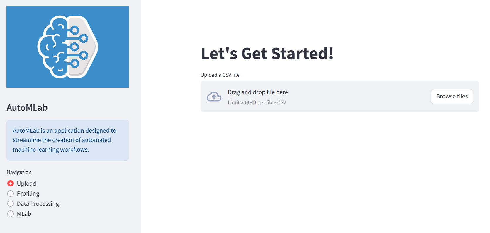

# AutoMLab: Automated Machine Learning Pipeline



**AutoMLab** is an application that allows users to build an automated machine learning pipeline using Streamlit and scikit-learn. The app provides an intuitive interface for uploading data, performing exploratory data analysis (EDA), preprocessing data, and building and evaluating machine learning models. The application provides informative warnings in case of errors during plotting, data processing, or model evaluation.

## Features

- **Upload**: Upload your data as a CSV file for modeling.
- **Profiling**: Perform automated exploratory data analysis, including visualizing data.
- **Data Processing**: Clean and preprocess your data, including handling missing values and encoding categorical data.
- **MLab**: Choose a machine learning method (regression or classification) and build models using various algorithms. Evaluate and visualize the models' performance with different plots and metrics.

## Getting Started

To get started with **AutoMLab**, follow the instructions below:

1. **Clone the repository**:

2. **Navigate to the project directory**:

3. **Install the required packages**:

    Ensure you have Python 3.x installed on your system. Install the required packages using `pip`:

    ```bash
    pip install -r requirements.txt
    ```

4. **Run the application**:

    ```bash
    streamlit run app.py
    ```

    This will start the Streamlit application.

## Usage

- In the **Upload** section, you can upload your data as a CSV file.
- In the **Profiling** section, explore the data and visualize it.
- In the **Data Processing** section, you can clean and preprocess your data.
- In the **MLab** section, choose the target variable and method (regression or classification), and build your model. Choose the plots and metrics you want to display.